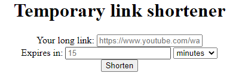

# Temporary link shortener

 A lightweight, easy to use website to shorten your links, for a short  amount of time.

‏‏‎ ‎



**How to use**

    You can use the public version without any limits [here](https://trilinder.pythonanywhere.com/).

‏‏‎ ‎

**How to host**

    1. [Download](https://github.com/TriLinder/TempLinkShortener/archive/refs/heads/main.zip) as a `.zip` file and decrompess into a new folder

    2. Run `pip install -r requirements.txt` inside the folder.

    3. Run `main.py`

    4. Done!

‏‏‎ ‎

**How to configure**

    The conifguration is located on the top of the `main.py` file

```python
def_url = "https://www.youtube.com/watch?v=jeg_TJvkSjg" #The URL address used, if the user doesnt set one
def_time = 15 #The amount of minutes used, if the user doesnt specify
def_length = 4 #The default length of the shortned link, will incrase itself if the links start running out
deleteExpiredOnStart = True #Wheter or not should the server go through all links and delete expired ones on startup, this could take a while with a lot of links
maxExpiryTime = 90 #The maximum amount of time in days the user can set the expiry time to
lengthLimit = 1024 #A character length limit for the original URL
port = 5000 #The port to host the website on
```

‏‏‎ ‎

**Shorten a link using the API**

To shorten a link, make a `POST` request to `/api/new_link/`, with the `User-Agent` header set to `api`. For `data` follow the example below.


This will simply return the short link ID, for example https://trilinder.pythonanywhere.com/VHiX has the ID of VHiX

‏‏‎ ‎

Python example:

```python
import requests

headers = {'User-Agent': 'api'}
data = {'org_url':'https://google.com/','expire_value':'12','expire_type':'minutes'}

r = requests.post('https://trilinder.pythonanywhere.com/api/new_link/',headers=headers,data=data)

short_url = r.content
```

‏‏‎ ‎

**Get the original link using the API**

To get the original link, make a `GET` request to `/api/get_link/<yourID>/`

This will return the original link. If the shortend link ID does not exist, this will simply return `none`

‏‏‎ ‎

Python example:

```python
import requests

id = "vRUa"
r = requests.get("https://trilinder.pythonanywhere.com/api/get_link/" + id)

originalLink = r.content
```
